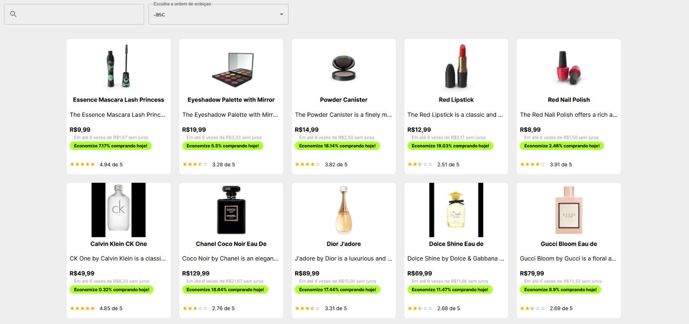

# **Apresentação:**



</br>
</br>

# :book: **Sobre:**

Este projeto foi criado utilizando Nextjs consumindo a api de produtos da [dummyjson.com](dummyjson.com). 
O principal objetivo desse projeto foi exercitar meus conhecimentos sobre a ferramenta e aprender mais sobre Nextjs.

---

</br>

**Conceitos e técnicas abordadas:**
- NextJs;
- App Routing através do NextJs;
- Styled Components;
- Material UI
- Material Icons

---

</br>

# :rocket: **Técnologias utilizadas:**

- **HTML5**;
- **CSS3**;
- **ES6**;
- **React**;
- **Next**;
- **Styled Components**;
- **Material UI**;

---

</br>

# :card_file_box: Como baixar o projeto

```js

// clonar o repositório

    $ git clone https://github.com/P-L-T-S/nextapp.git

// instalar as dependencias

    $ npm install

// iniciar o projeto

    $ npm run dev

```

<br/>

---

<br/>
<br/>

# :telephone: Contatos

<br/>

<div align="center">
    <a href="mailto:pedrolts16@gmail.com">
        
    </a>
    <a href="https://www.linkedin.com/in/pedro-teixeira-s/">
        
    </a>

<br/>

<br/>


### Feito com :heart: por [Pedro Leonardo](https://www.linkedin.com/in/pedro-teixeira-dev/)

</div>